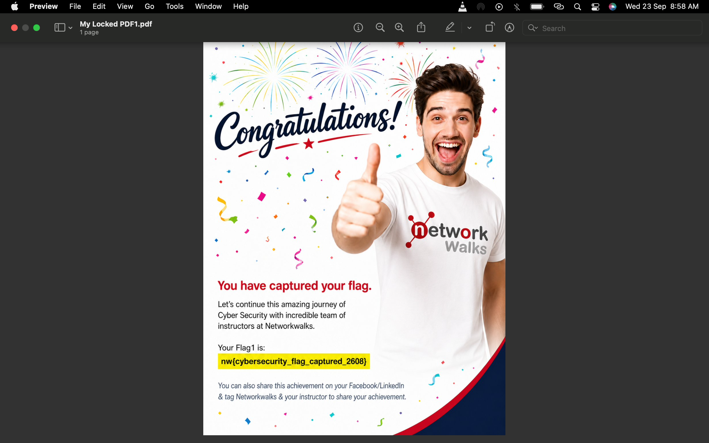
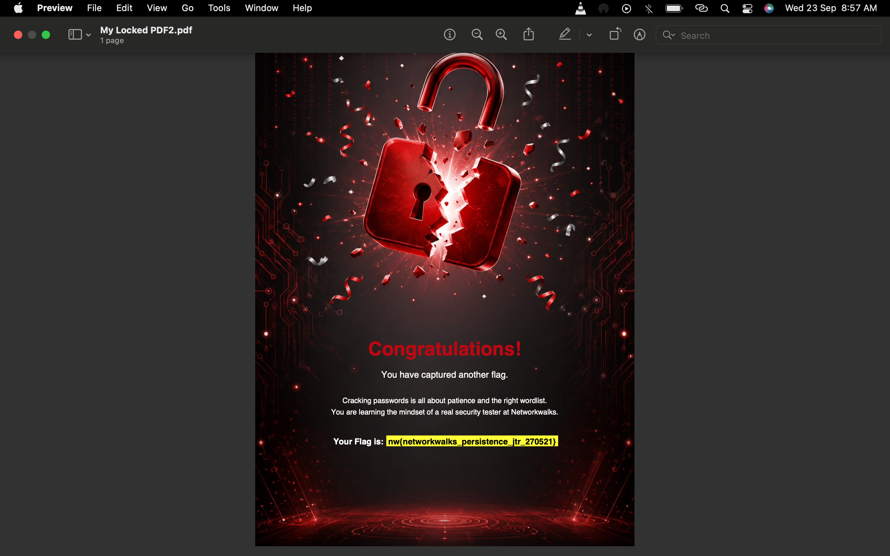
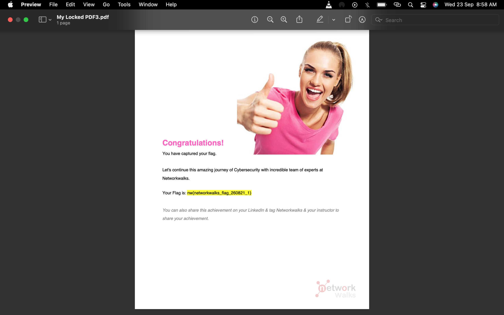

# Password Cracking Lab — Week 3 (Networkwalks Cybersecurity & Ethical Hacking Program)
This repository documents my work on **Week 3, Project Module 1 & 2** of the Networkwalks Cybersecurity & Ethical Hacking training program. The lab focuses on password cracking against encrypted PDF files using two different methods: John the Ripper (JTR) on Kali Linux, and Networkwalks' own browser-based hash cracking tools.

---

## 📋 Objectives

- Understand how password-protected files store their passwords as a hash rather than plain text.
- Learn how to extract a crackable hash from a password-protected PDF.
- Use **John the Ripper (JTR)** on Kali Linux to recover a PDF password via a dictionary attack.
- Use the **Networkwalks Hash Calculator** and **Password Cracker** (browser-based tools) to perform the same type of attack without installing any software.
- Understand why password strength and wordlist size directly affect how quickly a password can be cracked.

---

## 🛠️ Tools Used

| Tool | Purpose |
|---|---|
| **Kali Linux** (VirtualBox VM) | Operating system used to run John the Ripper |
| **John the Ripper (JTR) 1.9.0-jumbo-1** | Command-line password cracking tool |
| **pdf2john.pl** | Script bundled with JTR that extracts a crackable hash from a PDF |
| **VirtualBox Shared Folders** | Used to transfer the 3 locked PDF files from macOS host to the Kali VM |
| **Networkwalks Hash Calculator** ([networkwalks.com/hash-calculator](https://networkwalks.com/hash-calculator/)) | Browser tool to extract the `$pdf$...` hash from a locked PDF |
| **Networkwalks Password Cracker** ([networkwalks.com/password-cracker](https://networkwalks.com/password-cracker/)) | Browser tool that runs a dictionary attack against the extracted hash |

---

## 📁 Repository Structure

```
password-cracking-lab/
├── README.md
└── screenshots/
    ├── task1-jtr/
    │   ├── 01-hash-extraction-and-cracking.png
    │   └── 02-pdfs-unlocked-confirmation.png
    └── task2-nw-tools/
        ├── 01-hash-calculator-pdf1.png
        ├── 02-password-cracker-pdf1-success.png
        ├── 03-hash-calculator-pdf2.png
        ├── 04-password-cracker-pdf2-success.png
        ├── 05-hash-calculator-pdf3.png
        ├── 06-password-cracker-pdf3-success.png
        ├── 07-pdf1-unlocked.png
        ├── 08-pdf2-unlocked-flag.png
        └── 09-pdf3-unlocked-flag.png
```

---

## 🎯 Task 1 — Password Cracking with John the Ripper (Kali Linux)

**Goal:** Crack the password of 3 locked PDF files (`My Locked PDF1.pdf`, `My Locked PDF2.pdf`, `My Locked PDF3.pdf`) using JTR on Kali Linux.

---

### Step 1 — Confirm John the Ripper is installed

```bash
which john
john
```

Output confirmed John the Ripper `1.9.0-jumbo-1` was already installed on Kali.

---

### Step 2 — Confirm `pdf2john.pl` is available

```bash
locate pdf2john.pl
```

Found at:
```
/usr/share/john/pdf2john.pl
```

---

### Step 3 — Transfer the locked PDFs from macOS to Kali

Since the PDFs were on my MacBook and Kali was running in a VirtualBox VM, I transferred them using **VirtualBox Shared Folders** (Settings → Shared Folders → added the Mac's PDF folder, enabled Auto-mount and Make Machine-permanent).

Once mounted, I copied the files into my working directory on Kali:

```bash
mkdir -p ~/jtr-lab
cp /media/sf_pdf_locked/*.pdf ~/jtr-lab/
cd ~/jtr-lab
ls -la
```

---

### Step 4 — Extract the password hash from each PDF

```bash
perl /usr/share/john/pdf2john.pl "My Locked PDF1.pdf" > hash1.txt
perl /usr/share/john/pdf2john.pl "My Locked PDF2.pdf" > hash2.txt
perl /usr/share/john/pdf2john.pl "My Locked PDF3.pdf" > hash3.txt
```

Then combined all three hashes into a single file so John could attack them together:

```bash
cat hash1.txt hash2.txt hash3.txt > allhashes.txt
cat allhashes.txt
```

---

### Step 5 — Crack the hashes

```bash
john allhashes.txt
```

John used its default wordlist (`/usr/share/john/password.lst`) and cracked all 3 PDFs in about 2 seconds:

```
password1        (My Locked PDF2.pdf)
1qaz2wsx          (My Locked PDF3.pdf)
good-luck         (My Locked PDF1.pdf)
3g 0:00:00:02 DONE 2/3 (2026-09-22 13:28) 1.016g/s 43057p/s
```

---

### Step 6 — Display the cracked passwords cleanly

```bash
john --show --format=PDF allhashes.txt
```

```
My Locked PDF1.pdf:good-luck
My Locked PDF2.pdf:password1
My Locked PDF3.pdf:1qaz2wsx

3 password hashes cracked, 0 left
```


---

### Step 7 — Verify by opening each PDF

```bash
xdg-open "My Locked PDF1.pdf"
xdg-open "My Locked PDF2.pdf"
xdg-open "My Locked PDF3.pdf"
```

Entering each recovered password successfully unlocked all three PDFs.


### ✅ Task 1 Results

| File | Cracked Password |
|---|---|
| My Locked PDF1.pdf | `good-luck` |
| My Locked PDF2.pdf | `password1` |
| My Locked PDF3.pdf | `1qaz2wsx` |

---

## 🎯 Task 2 — Password Cracking with Networkwalks Tools

**Goal:** Crack the same locked PDFs using the free browser-based **Networkwalks Hash Calculator** and **Password Cracker**, following the steps in *W3-PM2 – Password Cracking with NW Tools*.

---

### Step 1 — Extract the hash using the Hash Calculator

For each PDF, I opened the [Networkwalks Hash Calculator](https://networkwalks.com/hash-calculator/), selected the **PDF** tab, and uploaded the locked file. The tool parsed it locally in the browser and returned a crackable `$pdf$...` hash.

📸 **PDF1 hash:** 
📸 **PDF2 hash:**
📸 **PDF3 hash:** 

---

### Step 2 — Run the Password Cracker (PDF1, PDF2 and PDF3)

I pasted each `$pdf$...` hash into the [Networkwalks Password Cracker](https://networkwalks.com/password-cracker/) and ran the attack using the tool's **built-in 100-password list**.

- **PDF1** cracked successfully → `good-luck`
  📸 

- **PDF2** cracked successfully → `password1`
  📸 
  
- **PDF3** cracked successfully → `1qaz2wsx`
  📸 

---

### Step 3 - Open each PDF with the cracked password

Using the passwords recovered above, I opened each PDF to confirm it unlocked successfully.

📸 **PDF1 unlocked:** 

📸 **PDF2 unlocked (flag captured):** 

📸 **PDF3 unlocked (flag captured):** 

---

### ✅ Task 2 Results

| File | Cracked Password | Wordlist Used |
|---|---|---|
| My Locked PDF1.pdf | `good-luck` | Built-in 100-password list |
| My Locked PDF2.pdf | `password1` | Built-in 100-password list |
| My Locked PDF3.pdf | `1qaz2wsx` | Built-in 100-password list |

---

⚠️ Disclaimer
🔒 This repository is for educational purposes only, completed as part of an approved lab exercise within the Networkwalks Cybersecurity & Ethical Hacking training program.

The PDF files used in this project were intentionally created and provided by Networkwalks for practice purposes. No real, private, or third-party data was accessed at any point.

⚖️ Password cracking, hash extraction, and related techniques should only ever be performed on systems, files, or accounts you own, or have explicit written permission to test. Attempting to crack passwords or access data that does not belong to you, without authorization, is illegal and violates ethical hacking principles.

✅ The goal of this lab is to build a practical understanding of how password security works, why weak passwords are risky, and how cybersecurity professionals identify and address these vulnerabilities, not to encourage unauthorized access of any kind.
🛡️ Please use the knowledge and tools demonstrated here responsibly and ethically.

---

*Completed as part of the Networkwalks Cybersecurity & Ethical Hacking Project Tasks — Week 3.*

---

Author: 
Alale Matthew

Cybersecurity Intern 

LinkedIn: 
